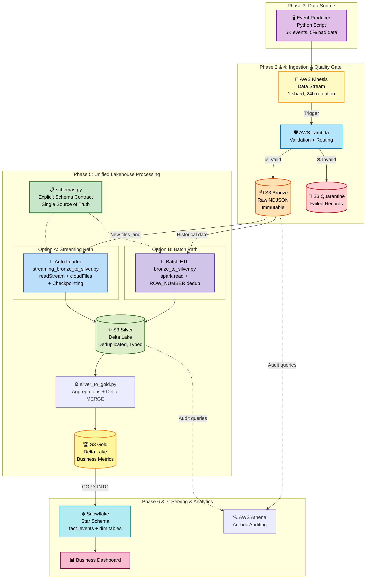

# 🗺️ Project Architecture Diagram — Unified Batch & Streaming

This diagram shows how your data travels from a "click" on a website all the way to a "business chart" in Snowflake — using **both Batch and Streaming** pipelines.

---

## 🔍 Component Breakdown

### 1. **Producer (Python)** — `producer/event_generator.py`
*   **Role:** Simulates a real e-commerce website. Creates random JSON events (login, product_view, add_to_cart, purchase, logout).
*   **Learning Point:** In production, this would be your website's backend or a mobile app SDK.

### 2. **Kinesis (The Highway)** — AWS Managed
*   **Role:** Buffers high-speed events. Decouples the website from storage.
*   **Learning Point:** Even if S3 or Lambda is slow, Kinesis catches events so nothing is lost. Retention = 24 hours by default.

### 3. **Lambda (The Security Guard)** — `lambda/transform_handler.py`
*   **Role:** Validates every event using rules in `data_quality.py`. Routes valid → Bronze, invalid → Quarantine.
*   **Learning Point:** "Garbage In, Garbage Out." We stop bad data at the door, not after it corrupts your dashboards.

### 4. **schemas.py (The Data Contract)** — `databricks/schemas.py` 🆕
*   **Role:** Defines the **Explicit Schema** used by BOTH Batch and Streaming jobs.
*   **Learning Point:** This is YOUR suggestion! Interviewers love seeing schema control instead of lazy `inferSchema=True`. It proves you care about data integrity.

### 5a. **Streaming Path (Auto Loader)** — `databricks/streaming_bronze_to_silver.py` 🆕
*   **Role:** Watches S3 Bronze and processes new files as soon as they arrive.
*   **Learning Point:** Uses `readStream` + `cloudFiles` + checkpointing for exactly-once processing. Best for near real-time dashboards.

### 5b. **Batch Path (Traditional ETL)** — `databricks/bronze_to_silver.py`
*   **Role:** Processes a specific date's data in one go. Uses `ROW_NUMBER()` for deterministic deduplication.
*   **Learning Point:** Best for historical reprocessing and backfills. Uses `spark.read` (not `readStream`).

### 6. **Gold Layer (Business Metrics)** — `databricks/silver_to_gold.py`
*   **Role:** Calculates DAU, conversion funnels, revenue metrics using Delta MERGE (upsert).
*   **Learning Point:** Gold is always Batch — business metrics need full historical context.

### 7. **Snowflake (The Analytics Store)** — `snowflake/schema.sql`
*   **Role:** Serves a Star Schema (fact_events + dim tables) for fast interactive SQL.
*   **Learning Point:** Analysts don't use Spark. They use SQL. Snowflake gives them sub-second query performance.

---

## 🎯 When to use Streaming vs Batch?

| Scenario | Use | Why |
|----------|-----|-----|
| New data arriving continuously | **Streaming** | Auto Loader picks up files instantly |
| Reprocessing last month's data | **Batch** | Targeted partition read is more efficient |
| Daily Gold metrics calculation | **Batch** | Aggregations need full day's data |
| Real-time fraud detection | **Streaming** | Latency matters (seconds, not hours) |
| Initial historical backfill | **Batch** | Process millions of old files at once |

*Last updated: April 2026 — Unified Architecture*
